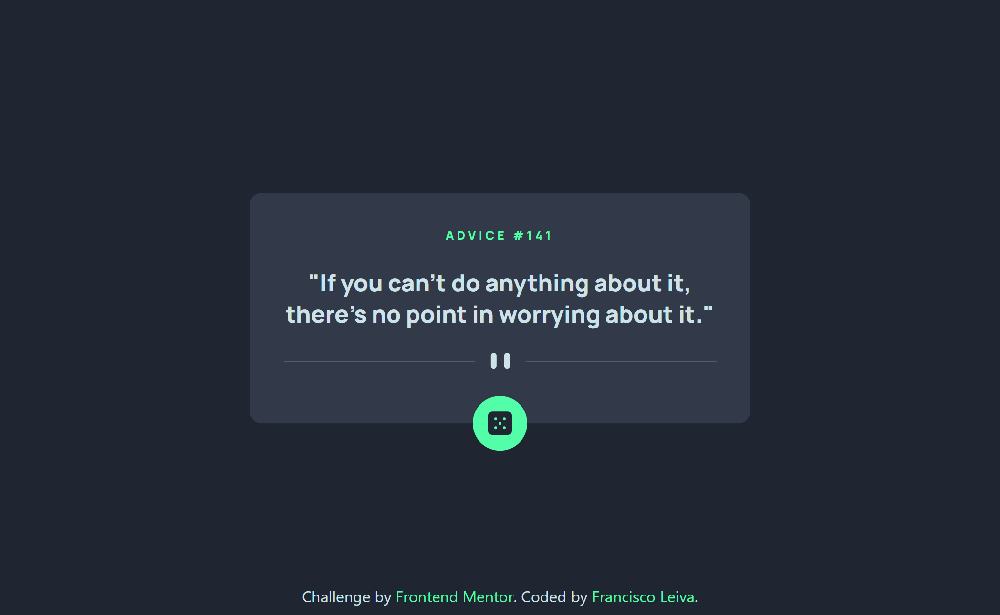
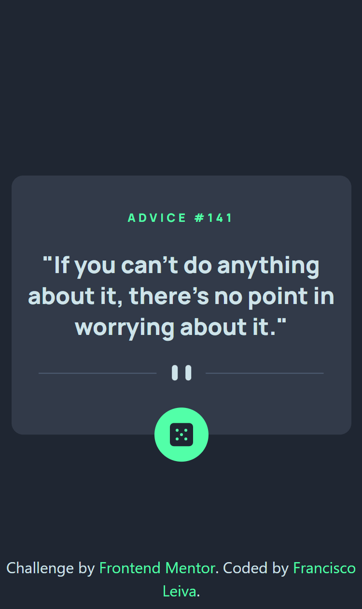

# Frontend Mentor - Advice generator app solution

This is a solution to the [Advice generator app challenge on Frontend Mentor](https://www.frontendmentor.io/challenges/advice-generator-app-QdUG-13db).

## Table of contents

- [Overview](#overview)
  - [The challenge](#the-challenge)
  - [Screenshot](#screenshot)
  - [Links](#links)
- [My process](#my-process)
  - [Built with](#built-with)
  - [Useful resources](#useful-resources)
- [Author](#author)

## Overview

### The challenge

Users should be able to:

- View the optimal layout for the app depending on their device's screen size
- See hover states for all interactive elements on the page
- Generate a new piece of advice by clicking the dice icon

### Screenshot

### Links

- Solution URL: [Click here](https://github.com/francisco-leiva/advice-generator-app)
- Live Site URL: [Click here](https://advice-generator-franciscoleiva.netlify.app/)

## My process

### Built with

- Tailwind CSS
- Mobile-first workflow
- [Vite + React](https://react.dev/) - JS library

## Author

- [LinkedIn](https://www.linkedin.com/in/franciscoleiva14/)
- Frontend Mentor - [@francisco-leiva](https://www.frontendmentor.io/profile/francisco-leiva)
